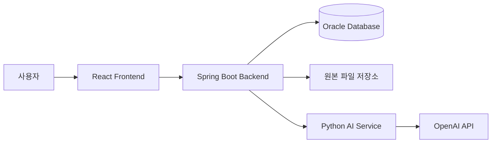

# Excel AI Agent

복잡한 Excel 워크북의 구조와 수식 관계를 분석하고, 근거가 확인된 인사이트와 질의응답, 승인 기반 수정 기능을 제공하는 AI 분석 플랫폼입니다.

단순히 Excel 내용을 요약하는 데 그치지 않고, 분석 결과가 어느 시트와 셀에서 도출됐는지 함께 보여주어 사용자가 결과를 직접 검증할 수 있도록 구성했습니다.

## 주요 기능

### 1. Excel 구조 분석

- `.xlsx`, `.xlsm` 파일 업로드 및 분석
- 시트별 입력·계산·출력·문서·시스템 역할 분류
- 표와 데이터 영역 자동 탐지
- 다중 행·병합 셀 기반 헤더 구조 인식
- 열 이름, 데이터 형식, 단위 및 주요 필드 분석
- 분석에서 제외된 시트와 제외 사유 확인

### 2. 수식 관계 분석

- 수식 참조 관계를 기반으로 계산 흐름 구성
- 서로 연결된 수식을 계산 군집으로 분류
- 시트 간 참조와 결과 영향 범위 추적
- 순환 참조 및 수식 위험 요소 탐지
- 주변 셀과 다른 반복 수식 패턴 확인
- 수식 원문과 검토가 필요한 셀 위치 제공

### 3. AI 정밀 분석

- Excel 데이터의 핵심 현황과 변화 요약
- 주요 사실, 영향 및 검토 포인트 생성
- 분석 결과와 일치하는 원본 시트·셀 근거 표시
- 자동 검증 결과에 따라 근거 일치도 제공
- 근거가 부족하거나 추가 확인이 필요한 내용 구분

### 4. 원본 근거 기반 질의응답

분석한 Excel에 자연어로 질문할 수 있습니다.

- 질문에 필요한 분석 도구를 Agent가 자동 선택
- Excel 내부 데이터와 수식을 검색하여 답변 생성
- 답변에 사용된 원본 시트와 셀 위치 표시
- 불명확하거나 의미 없는 질문은 분석하지 않고 재질문 안내
- 최신 질문은 바로 표시하고 이전 질문은 접어서 관리

### 5. 승인 기반 Excel 수정

자연어로 수정할 내용을 요청하고 변경 내용을 검토한 후 적용할 수 있습니다.

- 값, 범위 및 수식 변경안 생성
- 변경 전 값과 변경 후 값 비교
- 사용자 승인 전에는 파일을 수정하지 않음
- 원본이 아닌 복사본에만 변경 적용
- 수정 결과 자동 검증
- 승인자와 변경 내역을 이력으로 보관
- 검증이 완료된 수정본 다운로드

### 6. 사용자별 분석 이력

- 로그인 사용자별 분석 기록 분리
- 본인이 생성한 분석 결과만 조회 가능
- 다른 사용자의 분석 결과와 수정 내역 접근 차단
- 파일명 검색과 분석 이력 불러오기 지원
- 진행 중인 분석을 새로고침 후에도 이어서 확인

### 7. 원본 파일 보관 및 만료 처리

업로드한 원본 Excel 파일의 기본 보관기간은 7일입니다.

- 보관기간이 만료되어도 기존 분석 결과는 계속 조회 가능
- 만료된 기록에 `원본 보관 만료` 상태 표시
- 원본이 필요한 질문, 수정, 승인 및 다운로드 기능 자동 비활성화
- 분석 실패, 원본 만료, 이력 조회 실패 상태를 구분하여 안내

## 분석 방식

| 방식 | 설명 |
| --- | --- |
| 수식 관계 분석 | 규칙 기반으로 수식 참조, 계산 군집, 시트 역할과 위험 요소를 빠르게 분석합니다. |
| AI 정밀 분석 | 워크북 구조와 데이터를 LLM이 함께 검토하여 핵심 현황과 인사이트를 생성합니다. |

AI 정밀 분석은 워크북의 크기와 복잡도에 따라 `자동`, `빠른`, `정밀` 깊이로 실행할 수 있습니다.

## 설계 원칙

### 생성과 검증의 분리

LLM이 만든 문장을 그대로 내보내지 않습니다. 생성은 LLM이 담당하고, 그 결과가 실제 워크북에 근거하는지는 결정론적 검증기가 따로 판단합니다.

- 인사이트가 인용한 수치가 근거 셀에 존재하지 않으면 해당 문장을 버립니다.
- 근거로 제시된 셀·수식만을 화면에 노출해, 사용자가 직접 원본을 대조할 수 있습니다.
- 검증 규칙은 특정 도메인 용어에 의존하지 않고 표의 구조(라벨 유무, 셀 배열, 값 유형)로 판단합니다.

### 원본 보존을 전제로 한 수정 반영

수정 제안은 사용자가 승인한 항목만 반영하며, 반영 직전에 업로드 시점의 워크북 지문(수식, 병합 범위, 서식 ID, ZIP 파트 구성, VBA 해시)을 다시 대조합니다.
하나라도 어긋나면 쓰기를 중단합니다. 수식·서식·매크로는 그대로 유지됩니다.

## 시스템 구성



- Frontend는 화면 구성과 사용자 입력을 담당합니다.
- Backend는 인증, 분석 작업, 사용자별 이력, 파일 보관 및 수정 승인 절차를 관리합니다.
- AI Service는 Excel 구조 분석, 수식 관계 분석, AI 인사이트, 질의응답 및 수정안 생성을 담당합니다.
- Oracle Database에는 사용자, 분석 결과 및 변경 이력이 저장됩니다.

## 기술 스택

| 영역 | 기술 |
| --- | --- |
| Frontend | React 19, TypeScript, Vite, Tailwind CSS, TanStack Query |
| Backend | Java 21, Spring Boot, Spring Security, Spring Data JPA, Gradle |
| AI Service | Python, FastAPI, OpenPyXL, LangChain OpenAI |
| Database | Oracle Database 21c, Flyway |
| AI Model | OpenAI GPT-4.1 계열 |
| Test | JUnit, MockMvc, H2, Pytest |
| Development | Git, GitHub |

## 프로젝트 구조

```text
excel-ai-agent/
├── FE/             # React 기반 사용자 화면
├── BE/             # Spring Boot 기반 API와 데이터 관리
├── AI/             # Python 기반 Excel 분석 및 AI Agent
└── contracts/      # 서비스 간 데이터 계약 문서
```

## 실행 환경

- Java 21
- Node.js 20.19 이상
- Python 3.12 이상, 3.15 미만
- Oracle Database 21c
- OpenAI API Key

## 실행 방법

### 1. 저장소 복제

```bash
git clone https://github.com/hyeok02/excel-ai-agent.git
cd excel-ai-agent
```

### 2. Python AI Service 실행

```bash
cd AI
python3 -m venv .venv
source .venv/bin/activate
python -m pip install --upgrade pip
python -m pip install -e ".[dev]"
cp .env.example .env
```

`AI/.env`에 OpenAI API Key를 설정합니다.

```text
OPENAI_API_KEY=your-openai-api-key
```

AI Service를 실행합니다.

```bash
uvicorn app.main:app --reload --port 8000
```

- API 주소: `http://localhost:8000`
- Swagger UI: `http://localhost:8000/docs`
- Health Check: `http://localhost:8000/health`

### 3. Oracle 계정 생성

Backend는 시작 시 Flyway로 스키마를 생성하고 매핑을 검증하므로, 전용 계정을 먼저 만들어야 합니다. 테이블은 Flyway가 자동으로 생성합니다.

```sql
CREATE USER EXCEL_AI_AGENT IDENTIFIED BY your-password;
GRANT CONNECT, RESOURCE TO EXCEL_AI_AGENT;
ALTER USER EXCEL_AI_AGENT QUOTA UNLIMITED ON USERS;
```

### 4. Backend 실행

새 터미널에서 실행합니다.

```bash
cd BE
cp .env.example .env
```

`BE/.env`에 Oracle 접속 정보를 설정합니다.

```text
DB_URL=jdbc:oracle:thin:@//localhost:1521/XEPDB1
DB_USERNAME=EXCEL_AI_AGENT
DB_PASSWORD=your-password
AI_SERVICE_BASE_URL=http://localhost:8000
```

Backend를 실행합니다.

```bash
./gradlew bootRun
```

- API 주소: `http://localhost:8080`
- Health Check: `http://localhost:8080/api/v1/health`
- AI Service 연결 확인: `http://localhost:8080/api/v1/health/ai-service`

### 5. Frontend 실행

새 터미널에서 실행합니다.

```bash
cd FE
npm install
cp .env.example .env
npm run dev
```

브라우저에서 다음 주소로 접속합니다.

```text
http://localhost:5173
```

## 로컬 관리자 계정

최초 실행 시 개발용 관리자 계정이 생성됩니다.

```text
아이디: admin
비밀번호: admin1234
```

운영 환경에서는 반드시 `BOOTSTRAP_ADMIN_PASSWORD`를 변경해야 합니다.

## 주요 환경 변수

### AI Service

| 환경 변수 | 설명 |
| --- | --- |
| `OPENAI_API_KEY` | OpenAI API Key |
| `OPENAI_FAST_MODEL` | 빠른 분석 깊이에서 사용할 모델 |
| `OPENAI_STANDARD_MODEL` | 자동 분석 깊이에서 사용할 모델 |
| `OPENAI_PRECISE_MODEL` | 정밀 분석 깊이에서 사용할 모델 |
| `OPENAI_QA_MODEL` | Excel 질의응답 모델 |
| `OPENAI_WRITEBACK_MODEL` | Excel 수정안 생성 모델 |
| `OPENAI_TIMEOUT_SECONDS` | OpenAI 요청 제한 시간 |
| `OPENAI_MAX_COMPLETION_TOKENS` | 최대 응답 토큰 수 |

### Backend

| 환경 변수 | 기본값 | 설명 |
| --- | --- | --- |
| `SERVER_PORT` | `8080` | Backend 실행 포트 |
| `AI_SERVICE_BASE_URL` | `http://localhost:8000` | Python AI Service 주소 |
| `CORS_ALLOWED_ORIGINS` | `http://localhost:5173` | 요청을 허용할 Frontend 주소 |
| `UPLOAD_DIR` | `./uploads` | 원본 파일 저장 경로 |
| `UPLOAD_RETENTION` | `7d` | 원본 파일 보관기간 |
| `MAX_FILE_SIZE` | `50MB` | 업로드 가능한 단일 파일 크기 |
| `AUTH_SECURITY_ENABLED` | `true` | 로그인 및 접근 제어 활성화 |
| `BOOTSTRAP_ADMIN_USERNAME` | `admin` | 최초 관리자 아이디 |
| `BOOTSTRAP_ADMIN_PASSWORD` | `admin1234` | 최초 관리자 비밀번호 |

## 도메인 교차 회귀 테스트

검증 로직이 특정 업무 도메인에 맞춰 튜닝되는 것을 막기 위해, 서로 다른 도메인의 워크북 5종을 fixture로 두고 회귀 테스트를 실행합니다.
LLM 호출 없이 검증기의 판정만 비교하므로 결정론적으로 재현됩니다.

- 주체 식별
- 수치 변화 추출
- 근거 없는 문장 폐기
- 질문 구체성 판단

```bash
cd AI && python tests/run_analysis_regression.py
```

## 테스트

### Frontend

```bash
cd FE
npm run typecheck
npm run lint
npm run format:check
npm run build
```

### Backend

```bash
cd BE
./gradlew test
```

### AI Service

```bash
cd AI
source .venv/bin/activate
pytest
```

## 데이터 보호 원칙

- 분석 기록은 사용자 계정별로 분리됩니다.
- 다른 사용자의 분석 결과에 직접 접근할 수 없습니다.
- 원본 Excel은 설정된 보관기간이 지나면 자동으로 삭제됩니다.
- Excel 수정은 사용자 승인 후에만 실행됩니다.
- 원본 파일은 변경하지 않고 별도의 복사본을 생성합니다.
- 답변과 분석 결과에는 확인 가능한 원본 셀 근거를 함께 제공합니다.
